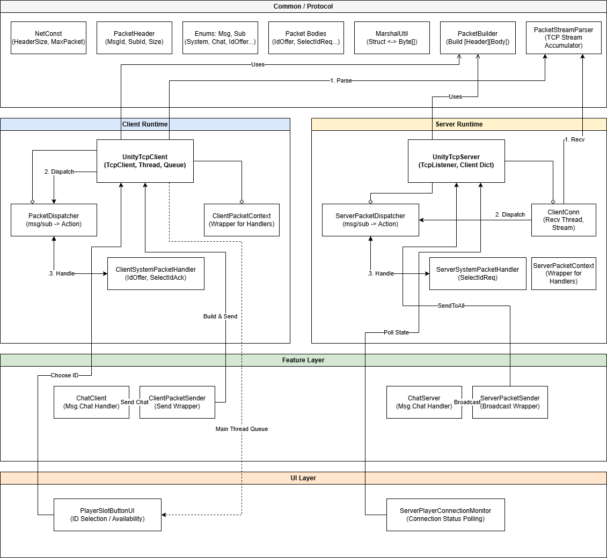

# Unity TCP Network Framework

Unity에서 TCP/UDP 기반 멀티플레이어 네트워크를 구현한 프레임워크입니다.  
Mirror, Netcode for GameObjects 같은 고수준 솔루션 없이 소켓 레벨부터 직접 구현하였으며,  
게임 로직 스크립트가 네트워크 코드를 몰라도 되도록 API 형태로 설계하였습니다.

<br>

## 아키텍처



<br><br>

## 왜 직접 만들었는가

Unity의 네트워크 솔루션(Mirror, NGO 등)은 강력하지만 내부 동작이 추상화되어 있어,  
패킷이 어떻게 만들어지고 어떻게 분기되는지 직접 이해하고 싶었습니다.

이 프로젝트에서 다음을 직접 구현하였습니다.

- TCP 스트림에서 완전한 패킷 단위로 잘라내는 파서
- 패킷 헤더 기반 핸들러 라우팅
- 네트워크 스레드와 Unity 메인 스레드 간 안전한 데이터 전달
- LAN 환경에서 서버를 자동으로 탐색하는 UDP Discovery

<br>

## 구현 내용

### TCP 스트림 파싱

TCP는 메시지 단위 전송을 보장하지 않습니다.  
한 번의 `Read()`가 패킷 1개라고 가정하면 다음 두 상황에서 데이터가 깨집니다.

- 패킷 1개가 여러 번에 나뉘어 도착 (반 패킷)
- 패킷 여러 개가 한 번에 붙어서 도착

`PacketStreamParser`는 수신 데이터를 버퍼에 누적한 뒤,  
`PacketHeader.PacketSize` 값을 기준으로 완성된 패킷이 모였을 때만 꺼냅니다.

```csharp
_parser.Append(recvBuf, read);
_parser.ConsumeAllAvailable(OnPacketComplete); // 완성된 패킷만 콜백으로 전달
```

<br>

### 패킷 구조

모든 패킷은 고정 크기 헤더 + Body 구조입니다.

```
[PacketHeader (8 bytes)][Body]

PacketHeader:
  - MessageId    : ushort — 대분류 (System, Chat, ...)
  - SubMessageId : ushort — 소분류 (IdOffer, SelectIdReq, ...)
  - PacketSize   : int    — Header + Body 전체 크기
```

구조체는 `[StructLayout(LayoutKind.Sequential, Pack = 1)]`을 적용하여  
서버/클라이언트 간 바이트 레이아웃을 일치시킵니다.

```csharp
// 패킷 생성
byte[] packet = PacketBuilder.Build(Msg.Chat, Sub.ChatEventReq, body);

// 패킷 파싱
var data = MarshalUtil.BytesToStruct<ChatEventReq>(packet, NetConst.HeaderSize);
```

<br>

### 패킷 라우팅

수신 패킷의 `(Msg, Sub)` 조합을 int 키로 변환하여 Dictionary에서 O(1)로 핸들러를 조회합니다.  
핸들러 추가 시 기존 코드를 수정할 필요 없이 `AddRoute()` 한 줄로 등록합니다.

```csharp
// 서버
server.AddRoute(Msg.Chat, Sub.ChatEventReq, HandleChat);

// 클라이언트
client.AddRoute(Msg.Chat, Sub.ChatEventReq, HandleChat);
```

<br>

### 메인 스레드 동기화

Unity API(UI 갱신, `Debug.Log` 등)는 메인 스레드에서만 호출 가능합니다.  
네트워크 수신은 별도 스레드에서 동작하므로 직접 호출하면 크래시가 발생합니다.

`ConcurrentQueue<Action>`에 작업을 예약하고 `Update()`에서 소비하는 방식으로 처리합니다.

```csharp
// 네트워크 스레드에서 예약
client.EnqueueMain(() => messageText.SetText(chat.Message));

// 메인 스레드(Update)에서 소비
while (_mainThreadQueue.TryDequeue(out var job))
    job?.Invoke();
```

<br>

### 플레이어 ID 슬롯 관리

서버가 플레이어 슬롯(0~9)의 사용 가능 상태를 `ushort` 1개의 비트마스크로 관리합니다.  
클라이언트가 접속하면 서버가 현재 선택 가능한 슬롯 목록을 전송하고,  
클라이언트가 원하는 슬롯을 선택하면 서버가 승인/거절 후 전체에 최신 상태를 전파합니다.

```
Server → IdOffer      → Client  (선택 가능한 슬롯 목록 전송)
Client → SelectIdReq  → Server  (원하는 슬롯 선택 요청)
Server → SelectIdAck  → Client  (승인 or 거절 + 최신 목록)
Server → IdOffer      → All     (전체 클라이언트에 상태 전파)
```

```csharp
// 슬롯 0,1,3 사용 가능 → 0b0000_0000_0000_1011 = 11
public ushort AvailableMask;
```

<br>

### UDP Discovery

LAN 환경에서 클라이언트가 서버 IP를 수동 입력하지 않아도 자동으로 탐색합니다.

```
Client ──UDP Broadcast──▶ (LAN 전체)
                           Server가 수신 → TCP 포트 정보 포함해서 응답
Client ◀──UDP Response──   Server
Client ──TCP Connect─────▶ Server
```

<br>

### 자동 재접속

연결이 끊기면 지수 백오프(1초 → 2초 → 4초)로 재접속을 시도합니다.  
재접속 시 이전에 선택했던 플레이어 슬롯을 유지하여 자동으로 재요청합니다.

```csharp
public bool autoReconnect = true;
public bool keepDesiredUserIdOnReconnect = true;
```

<br>

## 파일 구조

```
Assets/Scripts/Network/
├── Common/
│   ├── NetCommon.cs                   # 공통 상수, MarshalUtil, PacketBuilder, PacketStreamParser
│   └── NetEventStruct.cs              # PacketHeader, Msg/Sub Enum, 패킷 Body 구조체
├── Client/
│   ├── UnityTcpClient.cs              # TCP 클라이언트 MonoBehaviour
│   ├── ClientSystemPacketHandler.cs   # IdOffer, SelectIdAck 처리
│   └── PacketContext.cs               # 핸들러 결합도 완화 컨텍스트
├── Server/
│   ├── UnityTcpServer.cs              # TCP 서버 MonoBehaviour
│   └── ServerSystemPacketHandler.cs   # SelectIdReq 처리
├── Shared/
│   ├── PacketDispatcher.cs            # 패킷 라우터
│   └── EventSender.cs                 # 전송 전용 래퍼
├── Discovery/
│   ├── UnityNetDiscovery.cs           # UDP Discovery 클라이언트
│   └── UnityNetDiscoveryResponder.cs  # UDP Discovery 서버 응답기
└── Example/
    ├── ChatClient.cs                  # 클라이언트 사용 예시
    ├── ChatServer.cs                  # 서버 사용 예시
    ├── PlayerSlotButtonUI.cs          # ID 선택 UI
    └── ServerPlayerConnectionMonitor.cs
```
